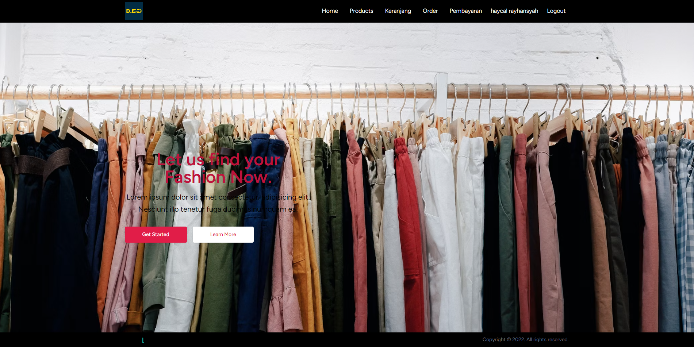
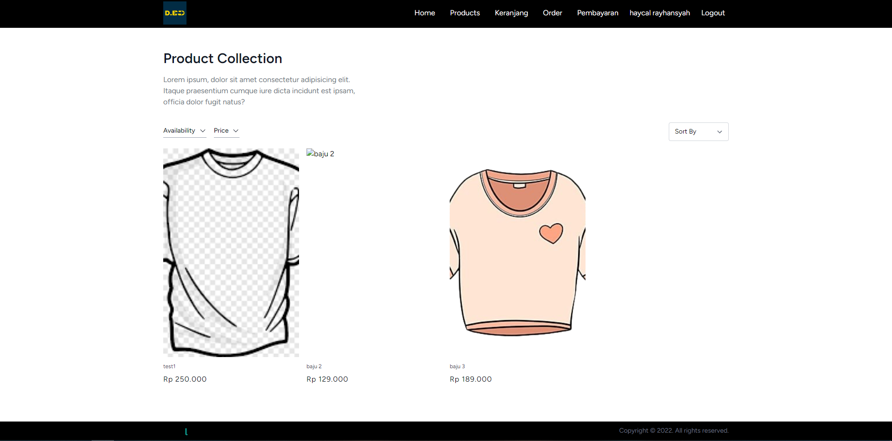
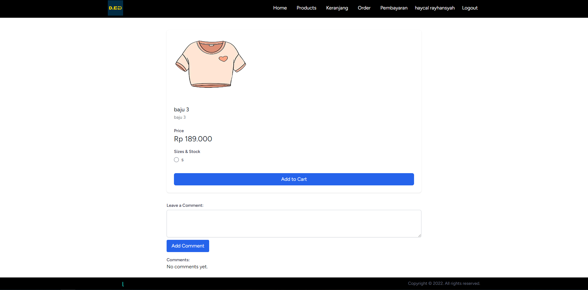
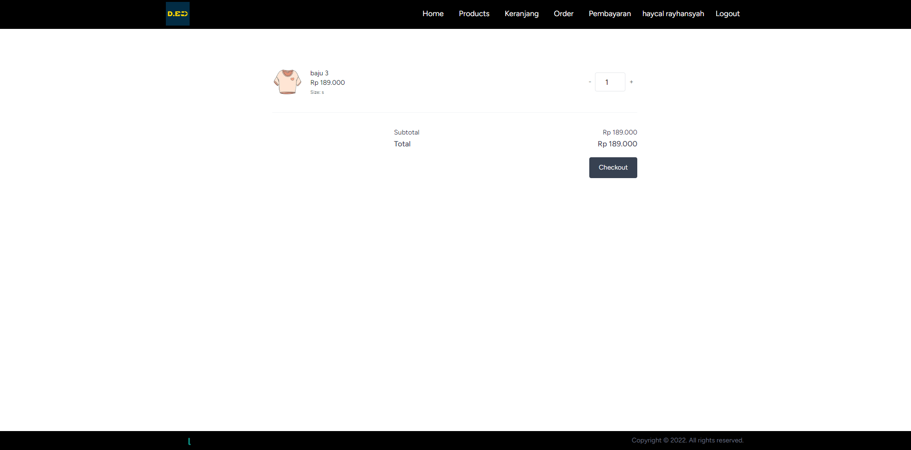
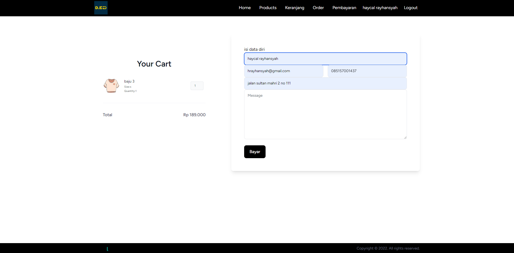
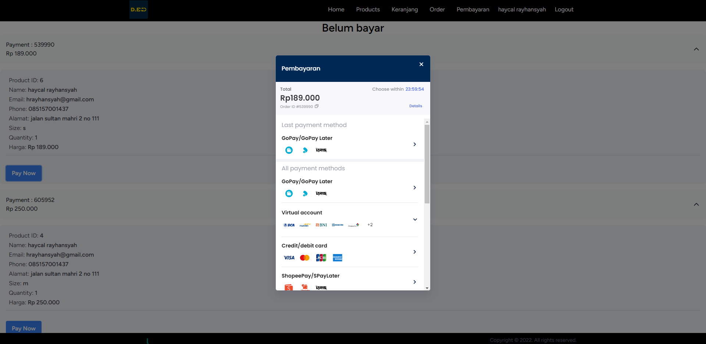
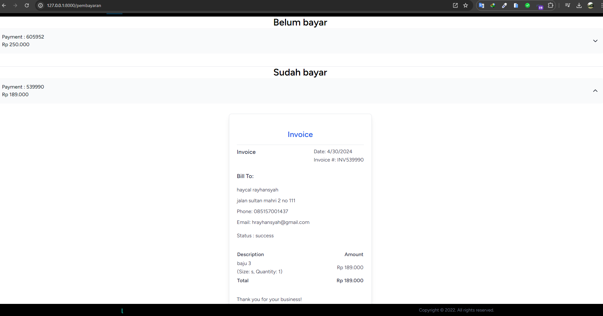
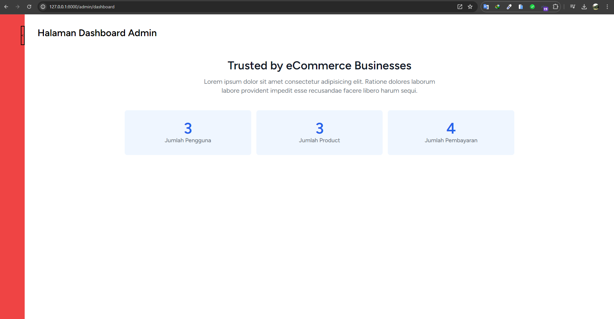
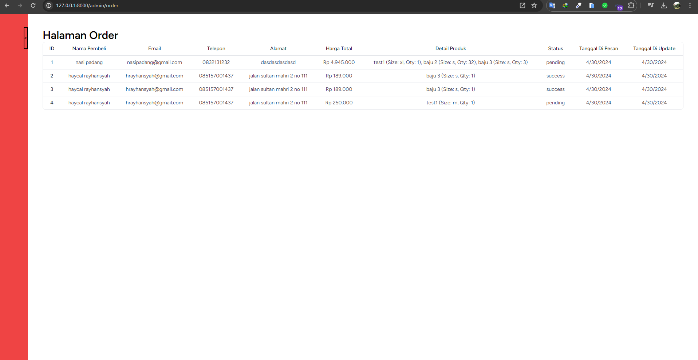

# Booking Baju 

## Fitur

-   Laravel11 React Inertia
-   Responsive website
-   Progressive Web Apps(Support All internet browser and mobile)
-   Integrasi Dengan Midtrans
-   Role

## PWA

1. 

### Daftar Gambar

1. 
2. 
3. 
4. 
5. 
6. 
7. 
8. 
9. 

## Instalasi

Untuk menginstal proyek ini, ikuti langkah-langkah berikut:

1. Clone repositori ini ke dalam direktori lokal Anda:

    ```bash
    git clone https://github.com/haycalrh21/TokoBajuLaravelInertia.git
    ```

2. Masuk ke direktori proyek:

    ```bash
    cd TokoBajuLaravelInertia
    ```

3. Install dependensi PHP menggunakan Composer:

    ```bash
    composer install
    ```

4. Install dependensi JavaScript menggunakan npm:

    ```bash
    npm install
    ```

## Penggunaan

-   php artisan migrate
-   php artisan serve
-   npm run dev

## Kontak

-   Haycal Rayhansyah(hrayhansyah@gmail.com)

## Kontak

-   hrayhansyah@gmail.com
